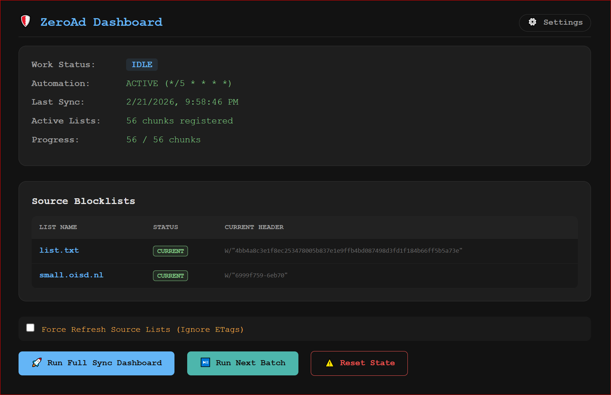
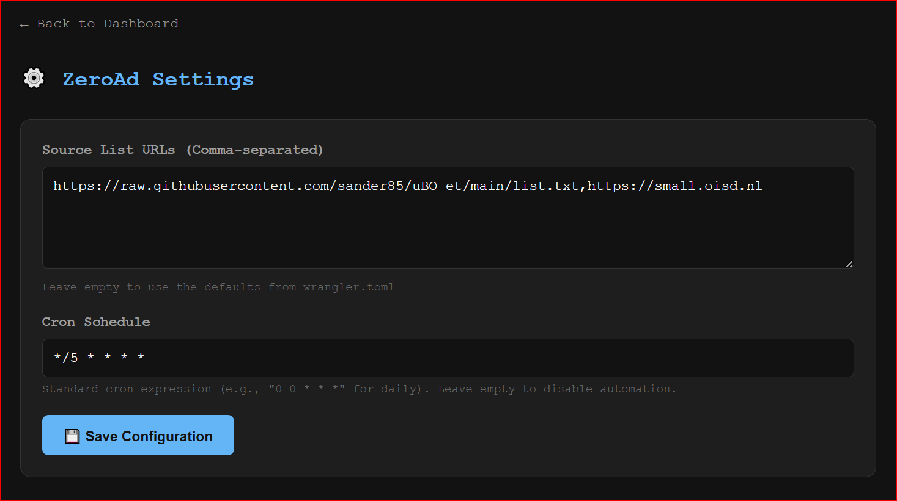

# ZeroAd: Native Cloudflare Worker AdBlocker

ZeroAd is a high-performance, serverless adblocker designed to run natively on **Cloudflare Workers (Free Tier)**. It automatically synchronizes popular ad-blocking and tracking protection lists with your **Cloudflare Zero Trust Gateway**.

## Features

- **Native Worker Implementation**: No external servers, GitHub Actions, or local scripts required for daily operation.
- **Dynamic Configuration UI**: Manage source list URLs and Cron schedules directly from the browser (KV & Cloudflare API-backed).
- **Stateful Orchestration (Cloudflare Workflows)**: Uses Workflows to handle long-running synchronization tasks. This ensures durability, automatic retries, and bypasses the strict 10ms CPU limits.
- **R2 Storage Integration**: Leverages R2 for temporary storage of large domain lists during the sync process, ensuring memory efficiency.
- **Smart Updates (ETag/Last-Modified)**: Uses HTTP header checks to detect source list changes, skipping unnecessary processing and saving API/KV units.
- **Streaming Interface**: Includes a `/stream` endpoint for real-time progress monitoring.
- **Multiple List Support**: Supports AdGuard and uBlock Origin syntax (`||domain^`, `@@||domain^`, etc.) with full whitelisting and prioritization.
- **Large Capacity**: Manages up to 90,000 domains (90 Gateway lists of 1,000 items each).

## Screenshots

### Control Center Dashboard


### Dynamic Settings


## Access Control & Security

Since this worker provides a web-based dashboard and settings page that can modify your Cloudflare account configuration, it is **highly recommended** to protect it:

1.  **Cloudflare Access**: Create a **Zero Trust Application** (Self-hosted) for your worker's domain.
2.  **Restrict Access**: Use an email or identity-based policy to ensure that only you can visit the dashboard, settings, and `/stream` endpoints.
3.  **No Auth by Default**: The worker itself does not implement authentication logic to keep the code lightweight and offload security to the Cloudflare edge.

## Inspiration & Thanks

This project was inspired by and built upon the logic and research of the following excellent projects:

- [cloudflare-zero-trust-adblock](https://github.com/cjscrofani/cloudflare-zero-trust-adblock) by cjscrofani
- [cloudflare-gateway-pihole-scripts](https://github.com/mrrfv/cloudflare-gateway-pihole-scripts) by mrrfv
- [update-cloudflare-gateway-adblock](https://github.com/unixfy/update-cloudflare-gateway-adblock) by unixfy
- [CloudflareGatewayAdBlock](https://github.com/IanDesuyo/CloudflareGatewayAdBlock) by IanDesuyo
- [Alex Wang's Blog Post](https://blog.alexwang.net/cloudflare-zero-trust-gateway-as-an-adblocker/)

## How It Works

ZeroAd uses **Cloudflare Workflows** to manage the complex synchronization process. When a cron trigger or manual action starts a sync, a workflow is spawned:

1.  **fetch-and-prepare**: Downloads source lists, parses them, and saves the result to R2.
2.  **update-gateway-lists**: Iteratively updates Cloudflare Gateway lists in the Zero Trust dashboard.
3.  **apply-policy**: Ensures the DNS firewall policy is using the correct list IDs.
4.  **cleanup**: Removes obsolete lists and temporary R2 assets.

### Cron Flow & Workflows

By using Workflows, the application gains native durability and avoids the "state machine" complexity previously required to stay within Worker resource limits:

-   **Native Durability**: Workflows automatically handle state persistence and retries if a step fails or is terminated.
-   **CPU Isolation**: Each step in the workflow has its own CPU budget, preventing the "Exceeded CPU" errors common when processing large datasets in a single Worker invocation.
-   **Smart Skip (ETags)**: Before starting a sync, the worker performs a lightweight `HEAD` request to check if the source lists have actually changed. If not, it skips the entire cycle, saving KV writes and API units.
-   **No Concurrency Hacks**: Workflows natively manage instance creation and execution, eliminating the need for manual heartbeat/locking mechanisms.

## Detailed Setup Guide

To protect your privacy, `wrangler.toml` is excluded from Git. Follow these steps to initialize your local environment:

### 1. Initialize Configuration
Copy the template configuration file:
```bash
cp wrangler.toml.example wrangler.toml
```

### 2. Get your Cloudflare Account ID
Find your Account ID by running:
```bash
npx wrangler whoami
```
Copy the ID from the output and paste it into `wrangler.toml` for both the top-level `account_id` and the `CLOUDFLARE_ACCOUNT_ID` variable.

### 3. Create the KV Namespace
Create the persistent storage for the worker:
```bash
npx wrangler kv:namespace create ADBLOCK_KV
```
Copy the `id` from the output (e.g., `f8b49529...`) and paste it into the `[[kv_namespaces]]` section of your `wrangler.toml`.

### 4. Create an API Token
Go to [My Profile > API Tokens](https://dash.cloudflare.com/profile/api-tokens) and create a **Custom Token** with these permissions:
- **Account** > **Zero Trust** > **Edit**
- **Account** > **Account Settings** > **Read**
- **Account** > **Workers Scripts** > **Edit** (For dynamic Cron management)

### 5. Set Secrets & Deploy
Add your token to the worker's secure storage and deploy:
```bash
npx wrangler secret put CLOUDFLARE_API_TOKEN
# Paste your token when prompted

npm install
npx wrangler deploy
```

## Usage

- **Status**: Visit the root URL `/` of your worker.
- **Stream/Manual Sync**: Visit `/stream` in your browser to see real-time progress.
- **Force Update**: Add `?force=true` to any request to bypass the Smart Skip header checks.
- **Reset**: Visit `/reset` to return the worker to its initial `IDLE` state.

## Potential Next Steps

- **HTTPS/Path-based Blocking**: Leverage Cloudflare Gateway's **TLS Inspection** to block ads by specific URL paths (e.g., `/js/ads.js`) rather than just whole domains.
    - *Requirements*: Installation of the Cloudflare Root Certificate on client devices and enabling TLS decryption in the dashboard.
    - *Implementation*: Extend the parser to extract path-based rules and sync them to `URL` type Gateway lists.
- **Advanced uBlock Origin Syntax**: Support more complex filters like regex-based blocking (where supported by Cloudflare) and more granular rule types.
- **Custom Allowlist Management**: Create a dedicated KV-backed interface or dashboard for managing personal whitelists without editing the source code.

## License

This project is licensed under the **GNU Affero General Public License v3 (AGPL v3)**. See the [LICENSE](LICENSE) file for the full license text.

## Did this save your day?

[](https://www.paypal.me/lepikj)
